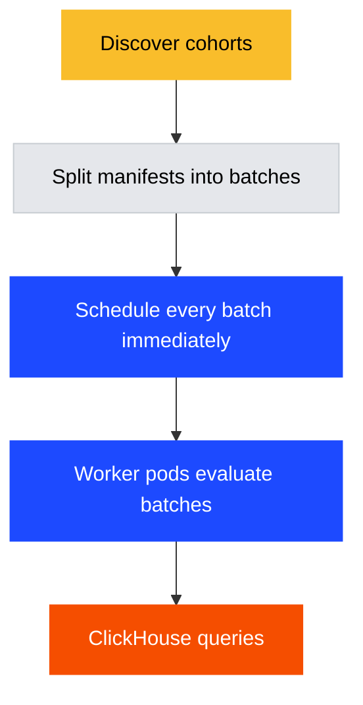
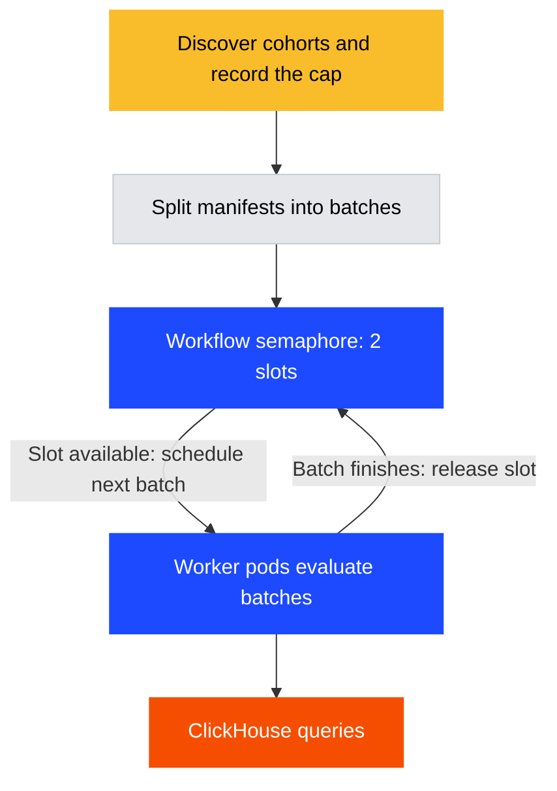

## Problem

Logs alert checks can get ClickHouse "too many simultaneous queries" errors, which skip the check for that cycle. The worker starts every batch of a cycle at once, so the burst at the start of each minute grows with the number of worker pods.

- Each pod runs `max_concurrent_activities` batches, and each batch runs `LOGS_ALERTING_MAX_CONCURRENT_COHORTS_PER_BATCH` queries. Nothing bounds the total across pods.
- Autoscaling adds pods when batches queue, which raises the burst further.
- The pod ceiling in [charts#16666](https://github.com/PostHog/charts/pull/16666) is a stopgap. It ties ClickHouse load to the deployment config instead of the workflow.

## Changes

- New `LOGS_ALERTING_MAX_CONCURRENT_BATCHES` caps how many batch activities one cycle runs at once. ClickHouse concurrency is then at most this value times the cohorts per batch, for any pod count.
- **Default `0` keeps today's behavior.** Nothing changes until charts sets the value.
- The cap is an `asyncio.Semaphore` in the workflow, gated by `workflow.patched("logs-alerting-bounded-batch-fanout")`. Runs that started before the deploy replay on the unbounded path. Same pattern as `surfacing_scoring_sweep`.
- Discovery records the cap in its output, the same way it records `batch_size`. A change to the env var never changes a replay.
- The new output field defaults to `0`, a second guard for histories recorded before it existed.

> [!NOTE]
> Keep `pods x MAX_CONCURRENT_ACTIVITIES` at or above the cap. With fewer activity slots than the cap, batches wait for a slot and the cycle runs slower than the cap allows. The constant's comment says this.

### Before: all batches scheduled together

### After: the workflow limits active batches

Example with a cap of **2**. The default **0** retains the unbounded path; old histories replay without the cap.

## How did you test this code?

- `test_workflow_chunks_manifests_and_aggregates_results` now runs with no cap, a cap of 2 and a cap of 1. It reads the peak count of scheduled-but-unfinished batch activities from workflow history. It fails against the current workflow for both caps and passes with this change. 10 of 10 local runs passed.
- New `test_logs_alerting_replay.py` replays two committed histories with Temporal's `Replayer`, following `process_task/tests/test_replay.py`:
  - `unbounded_before_patch`: recorded with master's workflow and the old discovery shape. 3 batches scheduled together.
  - `bounded_cap_2`: recorded with this workflow and a cap of 2. Patch marker, then 2 batches, then the 3rd after one completes.
- `histories/generate.py` re-records them after an intended workflow change. Worker and client identities are fixed to `replay-test-worker`.
- Mutation checks, run locally: removing the patch gate fails `bounded_cap_2`. Removing the gate and defaulting the field to 2 fails both histories. Keeping the gate with a default of 2 still passes, so the gate alone protects old runs. Ignoring the cap fails the parameterized workflow test.
- CodeRabbit CLI (`--deep`): one finding, see Agent context.

**Test rationale:** The replay tests catch any later change that makes an in-flight cycle fail with a nondeterminism error during a deploy, which strands that cycle's checks until the workflow times out. The parameterized cases catch a semaphore that is missing, ignored, or reads the wrong field. They extend the existing chunking test because the setup is the same. Asserting from history instead of from activity timing keeps the test deterministic.

## Release status

- [x] No feature flag controls this change <!-- release-status: no-feature-flag -->
- [ ] This change is behind a feature flag and is not available to users <!-- release-status: behind-feature-flag -->
- [ ] This change makes a previously flagged feature available to everyone <!-- release-status: fully-available -->

## Automatic notifications

- [ ] Publish to changelog?

## Docs update

None.

## 🤖 Agent context

**Autonomy:** Human-driven (agent-assisted)

- Tool and model: Claude Code, Opus 5.5 (`claude-opus-5-5`).
- Skills invoked: `writing-code-comments`, `writing-tests`, `reviewing-with-coderabbit`, `writing-pr-descriptions`.
- CodeRabbit CLI ran with `--deep` because the change alters workflow replay behavior. One finding: the first version of the test used a fixed 200ms sleep. Fixed. An event-based version raced too and no longer failed without the semaphore, so the test now asserts from workflow history.
- CodeRabbit, second run on the patch-gate commit: one finding, rejected. It asked to keep unmarked histories with a positive cap on the bounded path. Only earlier commits of this unmerged branch could record those, so none exist in any environment.
- Second PR in a series. The first, [#109850](https://github.com/PostHog/posthog/pull/109850), shards alert checks by team. A charts change sets the cap after this deploys.

🤖 Generated with [Claude Code](https://claude.com/claude-code)

