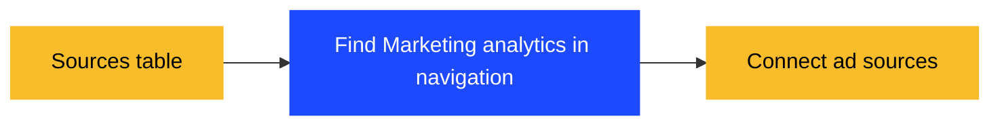
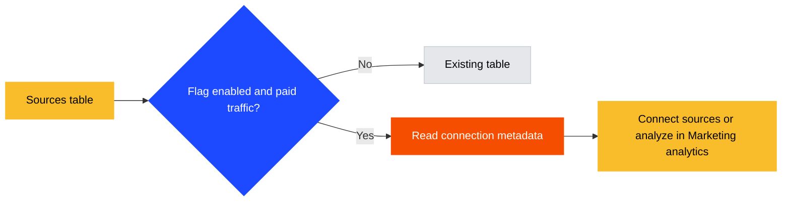

## Problem

Web analytics users who see paid traffic need a direct way to connect ad sources and compare campaign spend with website conversions.

## Changes

- Add a dismissible Marketing analytics card below Sources in Channel and all existing UTM table views.
- Use the same two variants across all supported breakdowns: **Connect ad sources**, or **Analyze in Marketing analytics** when a connection exists.
- Include UTM source, medium, campaign, content, term, and the combined source/medium/campaign view.
- Gate the card and its loaders behind `web-analytics-marketing-cross-sell`; disabled users make no additional requests.
- Reuse the Channels data node for paid traffic evidence. A direct UTM visit can load Channels once through the existing query cache.
- Fetch connection metadata only after detecting paid traffic. Preserve the selected dates in the destination and save dismissal per project.
- Link clicks to the first successful Advertising source creation within 24 hours using `cross_sell_id`, `source_id`, and the existing analytics SDK.
- Scope attribution to the same project, identified user, and browser tab; preserve it after failures and consume it after success.

> [!NOTE]
> Detection uses recognized paid channels in the returned table results. Paid traffic below the table limit or under arbitrary custom channel names can be missed.

Before, using the base tile implementation:

After, with the flag enabled:

Navigation before and after

Before:

After:

## How did you test this code?

Ran focused Jest tests, the full TypeScript check, frontend formatting, and strict preflight locally.
Ran the blocking DevEx Semgrep rules on the corrected files using the CI container image.
Browser automation rendered the Storybook states for Channel, source, campaign, connected sources, flag off, narrow layout, and dark theme.
Browser automation also verified all newly supported UTM views with synthetic paid traffic and navigation to Marketing analytics source setup.
No live ad-platform authorization flow was exercised.

**Test rationale:** Existing `skeletons.test.tsx` covers shared node props but does not mount this card.
The new component tests protect request reuse, flag gating, connection pagination, failures, dismissal, and date changes.
Existing component cases also cover source setup from UTM medium and connected-source navigation from the combined UTM view.
Date hydration cases prevent a saved end date from overriding an explicitly open range. URL assertions cover both buttons and subsequent navigation.
Helper tests reject organic and comparison-only traffic.
Attribution tests cover expiry, project/user isolation, latest-click matching, single-use conversion, and storage failure.
The existing wizard suite now covers attribution gating and failed-then-successful creation, where the source ID becomes available.

👉 _Stay up-to-date with [PostHog coding conventions](https://posthog.com/docs/contribute/coding-conventions) for a smoother review._

## Release status

- [ ] No feature flag controls this change
- [x] This change is behind a feature flag and is not available to users
- [ ] This change makes a previously flagged feature available to everyone

## Automatic notifications

- [ ] Publish to changelog?

## Docs update

Updated `docs/internal/web-analytics-query-serving.md` with gating, query reuse, routing, detection limits, and the attribution model. Revenue attribution requires joining billable usage to invoice amounts.

## 🤖 Agent context

**Autonomy:** Human-driven (agent-assisted)

**Agent:** Codex, GPT-6; PostHog Desktop, Claude Opus 5.5 (date-range review fix)

Tools: shell, GitHub CLI, browser automation, and hogli. No duplicate implementation appeared in the open-PR search.
Screenshots and fixtures use invented traffic data. The session link is omitted because unrelated private context must remain private.
Local CodeRabbit review was blocked by the environment's approval policy before execution.

Skills invoked: writing-ui-components, writing-user-facing-copy, writing-kea-logics, placing-product-frontend-code, writing-tests, setting-feature-flags-in-storybook, adopting-generated-api-types, writing-code-comments, hogli, running-ci-preflight, writing-pr-descriptions, reviewing-with-coderabbit, run-posthog, and debugging-ci-failures.

