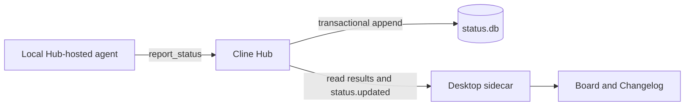

### Related Issue

No issue or feature discussion is currently linked. This PR is intentionally a draft while the remaining live-agent and native-app validation is completed.

### Description

Work status is currently spread across individual chats. This adds **Status Hub** below **Schedule** and **Customize** in the desktop sidebar, with a **Board** of the latest reported state of each work item and a **Changelog** of its updates. Reviewers can follow current work, inspect how it changed, and return to the reporting chat without replaying every transcript.

This is the first native Cline slice of Drive Mode's Status Hub. It adapts the status contracts, SQLite store, and store tests into Cline's shared/core/app boundaries. The desktop view is built with the existing Cline page layout and components. It adds no Drive package dependency, overlay requirement, external service, or new dependency.

#### What users see

- A Status Hub sidebar entry, including collapsed-sidebar access and dismissal of the sidebar in small windows.
- **Board:** one current report per `(sessionId, subject)`, grouped with blocked and failed work first, followed by running, queued, done, and cancelled. Within each state, newer reports appear first.
- **Changelog:** every report, newest first, with previous-state transitions and a Historical label on superseded entries.
- Global current-work counts, headline/detail search, state filtering, expandable details, optional progress and tags, a work item's chat-scoped history, and **Open chat**.
- Fifty results per page with **Load more**, explicit loading/error/empty states, and retry actions.
- Live first-page refreshes. After loading later pages, new reports offer **Show latest** instead of moving the reader's position. Reconnection refreshes the first page or offers the same action during a paged read.
- Switching into Status Hub keeps the active chat mounted and its draft intact; the obscured chat is inert and hidden from accessibility navigation.

For example, if one chat reports `tests` as Running and later Done, Board shows its Done report and Changelog retains both entries. Another chat reporting `tests` remains independent.

#### Backend flow and ownership

| Layer | Responsibility |
| --- | --- |
| `@cline/shared` | Browser-safe Zod contracts for reports, states, queries, pages, and summary counts; typed `status.board`, `status.query`, and `status.summary` commands; `status.updated` event name and advertised read capabilities. |
| `@cline/core` | A `StatusService` owned by the Hub transport, a dedicated SQLite store, the reporting tool and prompt guidance, lifecycle cleanup, and read-command handling. The stateless agent package does not own persistence. |
| Desktop sidecar | Reads through the existing authenticated local Hub client and forwards committed status events, including reports from chats that are not currently attached. |
| Desktop webview | Validates responses, queries and pages the store, reacts to invalidation events, and renders the two views. Request-generation checks discard stale responses after filters/views change or the component unmounts. |

The Hub injects `report_status` and its guidance through the existing `session.create`/restore plumbing. The same plumbing covers Agenda task sessions. This is a Hub session contribution, so reporting is not dependent on the desktop Status Hub view being open.

The model supplies only the subject, state, headline, optional detail, priority, progress, and tags. **Session and agent identity come from the trusted tool execution context; workspace identity comes from the session record.** Unknown identity fields are rejected. There is no client-facing status publish command. Existing tool enablement and approval policies still apply.

Reporting is explicit: guidance asks the agent to report meaningful starts, milestones, blockers, and completion, rather than every tool call. Headlines and progress are agent-reported claims; this PR does not calculate progress from tool activity or infer it from transcripts.

#### Storage and lifecycle rules

- The default file is `<Cline data directory>/db/status.db` (normally `~/.cline/data/db/status.db`). Existing Cline directory overrides apply; `CLINE_STATUS_DB_PATH` or the Hub's `statusDbPath` option can isolate the store. The schema is initialized automatically.
- A transaction assigns a monotonic sequence, supersedes the previous current row for the same chat and subject, and appends the new report. A partial unique index enforces one current row. History remains available, and sequence-based keyset paging also respects Board's state ordering.
- The schema replaces the earlier global-subject unique index with the chat-scoped index while preserving existing rows. History counts and previous-state lookup use the same scope.
- Search uses FTS5 when available and escaped LIKE otherwise. Query page size is bounded at 200; the desktop requests 50. Summary counts cover all current reports, independently of visible filters/pages.
- A committed write emits `status.updated` through the existing Hub event stream. The desktop uses it to re-query persisted results.
- On session end, queued/running/blocked reports receive a Cancelled entry with the ending reason and last headline. Done/failed/cancelled reports are preserved. A successful session ending does **not** imply its unfinished work succeeded: without an explicit final report, that work closes as Cancelled.
- Before a newly constructed local runtime starts sessions, reports left open by a previous Hub instance close the same way. Supplied runtime hosts skip this sweep because they may already own live sessions. The sweep assumes the internally owned runtime is the owner of unfinished session reports in its configured file.
- If status storage cannot initialize, the reporting tool is omitted and status reads return `status_unavailable`; normal Hub chat service can continue. Query errors are surfaced separately. Cleanup errors are logged without blocking normal session event projection.

#### Scope and remaining work

This draft supports local Hub-hosted lead chats and Agenda task sessions. Existing resident chats must be restored/restarted to receive the new tool; old transcripts are not backfilled. Status remains local to the queried Hub.

The following are deliberately **not claimed as complete**:

- **Schedule/cron reporting:** that execution path creates a separate `LocalRuntimeHost` and needs reporting-tool, guidance, and lifecycle wiring.
- **Delegated `spawn_agent` reporting:** its tool factory builds a separate tool set and does not currently inherit `report_status`. Team/delegated-agent coverage needs an explicit integration and validation pass.
- **Cloud/SSH aggregation:** the desktop reads the local Hub, without merging reports from remote runtimes.
- **History retention/chat deletion integration:** the store has a pruning primitive, but no automatic pruning job or deletion UX is connected.
- **Native packaged-app and real model verification:** current manual preview evidence uses isolated fixture reports, without provider/model calls.

There is no feature flag in this change: a Hub with available status storage contributes the tool and serves its read commands. A rollout must package the updated SDK/Hub, sidecar, and webview together.

#### Suggested review order

1. [`status.ts`](https://github.com/cline/cline/blob/3560938e162cbbc0ea4fc7e6697655d74a8ab08f/sdk/packages/shared/src/status.ts) and [`hub.ts`](https://github.com/cline/cline/blob/3560938e162cbbc0ea4fc7e6697655d74a8ab08f/sdk/packages/shared/src/hub.ts): contracts and additive protocol surface.
2. [`sqlite-status-store.ts`](https://github.com/cline/cline/blob/3560938e162cbbc0ea4fc7e6697655d74a8ab08f/sdk/packages/core/src/status/store/sqlite-status-store.ts) and [`status-schema.ts`](https://github.com/cline/cline/blob/3560938e162cbbc0ea4fc7e6697655d74a8ab08f/sdk/packages/core/src/status/store/status-schema.ts): transactional writes, scoping/migration, query ordering, and fallback search.
3. [`report-status-tool.ts`](https://github.com/cline/cline/blob/3560938e162cbbc0ea4fc7e6697655d74a8ab08f/sdk/packages/core/src/status/report-status-tool.ts), [`status-service.ts`](https://github.com/cline/cline/blob/3560938e162cbbc0ea4fc7e6697655d74a8ab08f/sdk/packages/core/src/status/status-service.ts), and the Hub transport integration: attribution, guidance, and lifecycle semantics.
4. Desktop sidecar `commands.ts`/`context.ts`, [`use-status-hub.ts`](https://github.com/cline/cline/blob/3560938e162cbbc0ea4fc7e6697655d74a8ab08f/apps/examples/desktop-app/webview/hooks/use-status-hub.ts), and [`status-hub-view.tsx`](https://github.com/cline/cline/blob/3560938e162cbbc0ea4fc7e6697655d74a8ab08f/apps/examples/desktop-app/webview/components/views/status-hub/status-hub-view.tsx): transport, invalidation, race handling, and UI.
5. Companion tests and updates to `sdk/ARCHITECTURE.md`, `sdk/DOC.md`, and the desktop README.

### Test Procedure

Validation was run locally with Bun 1.4.2 after rebasing onto `4515a410a` (`main`, desktop v0.0.41). Results below are scoped checks, not a claim that the entire monorepo gate or CI has passed.

| Check | Result / coverage |
| --- | --- |
| Frozen dependency install; `bun run build:sdk` | Passed. SDK consumers use rebuilt compiled package exports. |
| Core `bun run test:unit -- src/status src/hub/server` | **213 tests / 20 files passed**. Store/service tests plus the Hub server suite cover scoped supersession, reopen/migration, pagination, filtering, FTS/LIKE behavior, attribution rejection, committed events, lifecycle closure, invalid queries, and storage failure isolation. |
| Desktop `TMPDIR=/private/tmp bun run test:sidecar` | **1,158 tests / 61 files passed**. Includes Status Hub UI, sidecar proxy/event forwarding, existing sidebar/chat/settings coverage, and navigation behavior. |
| Core `bun run typecheck` | Passed, including its smoke typecheck. |
| Desktop `bun run typecheck` | Passed for the sidecar/dev configuration. |
| Desktop `bun run build:web` | Passed production compilation/static export, verifying browser imports do not pull in Node-only SDK modules. The existing Next configuration skips type validation; this is not a full-webview typecheck pass. |
| Full webview `bun tsc -p tsconfig.json --noEmit` | **Not passing:** 102 upstream diagnostics. A separately exported current-main baseline with the same dependencies/build outputs reports the same diagnostic counts by file and TypeScript code; no additional diagnostic was introduced by this feature. |
| Biome on all changed TS/TSX/JSON files; `git diff --check` | Passed. Commit-time gitleaks scan also passed. |
| Manual headless preview | Verified sidebar placement, Board/Changelog rendering against a real local Hub/store with fixture reports, search, and small-window navigation. No LLM/provider turn was run. |

The macOS desktop test invocation uses `TMPDIR=/private/tmp` to avoid an existing `/var` versus `/private/var` path-equality failure reproduced on the clean baseline. The test source was not changed to hide that failure. Node's missing-FTS behavior is covered through the forced LIKE path under Bun; a native multi-platform installation smoke test has not been run.

To reproduce the focused checks, build SDK exports first at the repository root, then run the core commands from `sdk/packages/core` and the desktop commands from `apps/examples/desktop-app`. The full webview compiler command above runs from its `webview` directory. Hub tests were run with a temporary `CLINE_DIR` and local loopback access.

Before marking this ready for review:

- [ ] Build and run the native desktop app with the matching rebuilt Hub/sidecar/webview.
- [ ] In a real new chat, confirm the model receives and uses `report_status`, and verify behavior with the normal tool approval settings.
- [ ] Observe Running -> milestone/blocker -> Done in Board and Changelog; verify same-subject reports in two chats remain independent and Open chat reaches the correct chat.
- [ ] Restart the app/Hub; verify history persists, unfinished reports close as documented, and completion/cancellation/error behavior matches the intended product contract.
- [ ] Assess CI results and the existing full-webview diagnostics separately from this feature's checks.

### Type of Change

- [ ] Bug fix
- [x] New feature
- [ ] Breaking change
- [ ] Refactor changes
- [x] Cosmetic/UI changes
- [x] Documentation update
- [ ] Workflow changes

### Pre-flight Checklist

- [x] Changes are limited to the native Status Hub feature and its documentation/tests.
- [ ] Full repository tests, format, and lint gates have passed. Only the scoped checks listed above have been run.
- [x] Contributor guidelines have been reviewed; the missing issue/discussion link is disclosed above.

### Screenshots

These captures show the desktop webview connected to a real local Hub and SQLite store, using **isolated fixture reports**. Each report is tagged **Preview fixture**. They illustrate the UI and stored-data flow; packaged-app and live-agent validation remain pending.

#### 1. Board: current work and sidebar entry

**Status Hub** sits below **Schedule** and **Customize**. Board shows the latest report per work item, with blocked work first, global current-work counts, priority, progress, expandable details, an update count, and **Open chat**. Here, five reports resolve to three current work items.

#### 2. Changelog: what changed

The same five reports appear newest first. **Running → Blocked** and **Running → Done** make the state changes explicit; superseded reports remain visible with a **Historical** label. Search and state filtering are available in both views.

#### 3. Item history: follow one work item

Clicking **2 updates** on the Board's Done item opens its chat-scoped history. This view shows the earlier Running report and the later Done report, with **Details** expanded. **Clear** removes the history scope, and **Open chat** provides the route back to the reporting chat; these fixture captures do not demonstrate a live-chat round trip.

### Additional Notes

Please focus review on the `(sessionId, subject)` ownership boundary, cancellation/startup recovery semantics, reporting frequency and approval UX, and the local-only producer scope. The store is adapted from Drive Mode, while the service/tool and desktop integration are native to Cline. A first-time dev preview on an explicit test Hub port hit the existing Hub-client cold-start auth-token issue; restarting after discovery was available worked. That unrelated startup fix is not included or counted as a successful cold-start check here.
