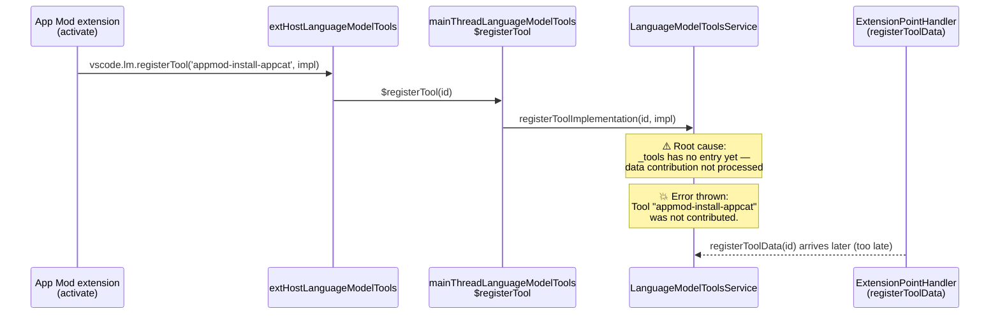

### Summary

`unhandlederror-Tool "appmod-install-appcat" was not contributed.` is thrown on the main thread when an extension registers a language-model **tool implementation** (via `vscode.lm.registerTool(id, ...)`) before the matching **tool data** from that extension's `package.json` `languageModelTools` contribution has been registered by `LanguageModelToolsExtensionPointHandler`. This is an activation-ordering race: three App Modernization tools (`appmod-install-appcat`, `appmod-run-assessment`, `appmod-build-docker-image`) each hit it, affecting ~104 users across Linux, Windows and Mac. The fix buffers an early implementation and attaches it when the tool data arrives, so the race no longer throws.

Fixes microsoft/vscode#339102
Recommended reviewer: ``@bhavyaus``

### Culprit Commit

| Field | Value |
|-------|-------|
| Commit | Not identified — see below |
| Author | n/a |
| PR | n/a |
| Message | n/a |
| Why | No commit in the regression range (`544a8291...73d5322b`) touches `languageModelToolsService.ts`, `languageModelToolsContribution.ts`, `mainThreadLanguageModelTools.ts`, or `extHostLanguageModelTools.ts`. This is **not** a code regression in those files. The bucket is a re-occurrence of the error family previously addressed by PR #326651 (*"register LM tools extension point handler at BlockStartup"*, milestone 1.131.0, owner ``@bhavyaus``). That fix moved the producer earlier but did not make the ordering impossible: the per-extension contribution *delta* for a newly-activated extension can still be delivered **after** that same extension's `activate()` has already called `vscode.lm.registerTool(...)`. The new bucket surfaced because the App Modernization extension began shipping `appmod-*` tools that activate through a non-tool path and register their implementations eagerly, re-exposing the latent race. |

### Code Flow

### Affected Files

| File | Role | Evidence |
|------|------|----------|
| `src/vs/workbench/contrib/chat/browser/tools/languageModelToolsService.ts` | crash site + root cause (fixed) | L384-L386 (pre-fix): `const entry = this._tools.get(id); if (!entry) { throw new Error(\`Tool "\$\{id}" was not contributed.\`); }` |
| `src/vs/workbench/api/browser/mainThreadLanguageModelTools.ts` | trigger (RPC) | L93: `$registerTool` calls `registerToolImplementation(id, ...)` from the fire-and-forget extHost RPC |
| `src/vs/workbench/contrib/chat/common/tools/languageModelToolsContribution.ts` | producer of tool data | L289: `languageModelToolsService.registerToolData(tool)` runs from the extension-point handler's `setHandler` delta |
| `src/vs/workbench/api/common/extHostLanguageModelTools.ts` | trigger origin | L344-L346: `registerTool` immediately calls `_proxy.$registerTool(id, ...)` during extension activation |

### Repro Steps

1. Install/enable an extension (e.g. App Modernization) that both declares tools in its `package.json` `languageModelTools` contribution and calls `vscode.lm.registerTool('appmod-install-appcat', impl)` early in `activate()`.
2. Cause the extension to activate through a non-tool path so its `activate()` runs before `LanguageModelToolsExtensionPointHandler` has processed that extension's contribution delta.
3. The main thread executes `registerToolImplementation('appmod-install-appcat', ...)` while `_tools` has no entry for the id, and throws `Tool "appmod-install-appcat" was not contributed.` into error telemetry.

Note: this is an activation-ordering race, so it reproduces intermittently depending on extension activation timing relative to extension-point delta delivery.

### How the Fix Works

**Chosen approach** — `src/vs/workbench/contrib/chat/browser/tools/languageModelToolsService.ts`:

- `registerToolImplementation(id, tool)` no longer throws when `_tools` has no entry for `id`. Instead it buffers the implementation in a new `_pendingToolImpls` map and returns a disposable that cleans up whether the impl is still pending or has since been attached. A second pending implementation for the same id still throws `already has an implementation`, preserving the duplicate-registration signal.
- `registerToolData(toolData)` now checks `_pendingToolImpls` after inserting the entry and attaches any buffered implementation to the newly created entry.

This fixes the **data producer's ordering problem at the producer/consumer boundary in the service**, not at a crash-site guard: the two registration halves (data from the extension-point handler, implementation from the extHost RPC) can arrive in either order, and the service now makes the unsupported order representable and self-healing. This mirrors the invoke path, which already tolerates the reverse race (it activates the extension and re-reads `_tools` for the impl at `languageModelToolsService.ts:584`). The genuinely-missing-tool signal is still preserved everywhere it matters: `invokeTool` still throws `Tool <id> was not contributed` when neither data nor impl ever arrives, so a typo'd id surfaces at invocation time via the existing telemetry path rather than being silently swallowed.

**Alternatives considered:**
- Re-adjusting the extension-point handler's lifecycle phase again (as PR #326651 did) — rejected because the handler is already at `BlockStartup` and the race is between a *per-extension* contribution delta and that same extension's activation, which phase ordering cannot serialize.
- Wrapping the `$registerTool` RPC in try/catch at the main-thread boundary — rejected because it swallows the error at the crash site and hides genuine missing-contribution cases from telemetry instead of fixing the ordering.

### Recommended Owner

``@bhavyaus`` — owner of the language-model tools area and author of the prior fix for this exact error family (PR #326651). Active in `microsoft/vscode` within the last 90 days (commits through 2026-10-01) and holds write access.
